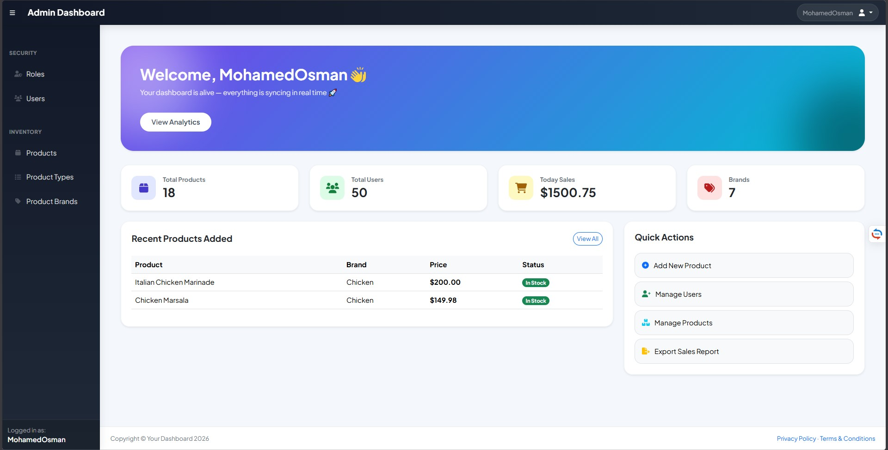
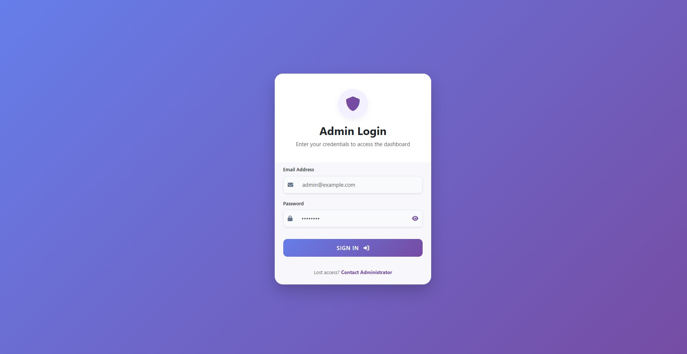
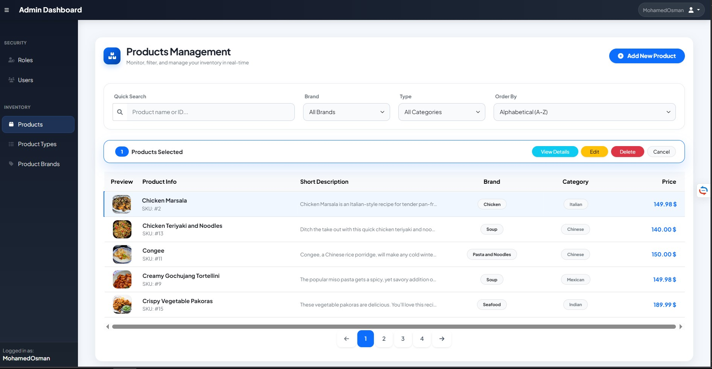
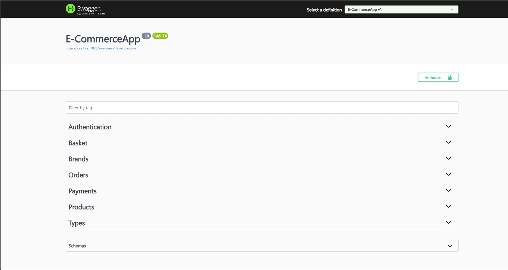
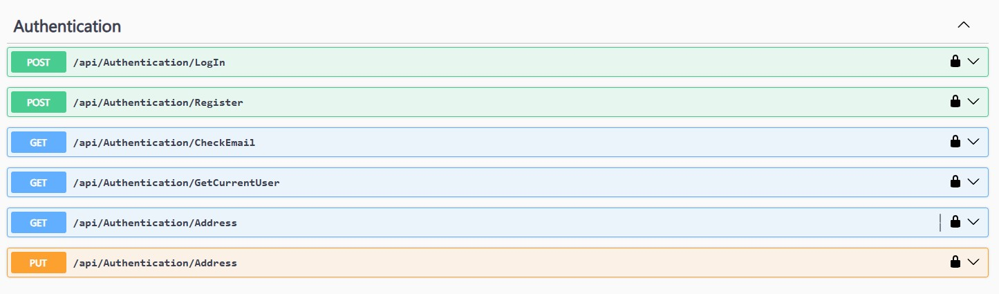
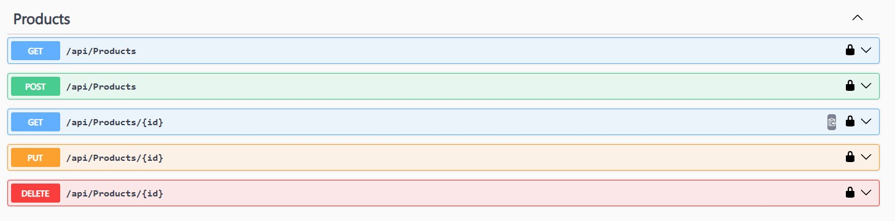

# 🚀 E-Commerce System (.NET 8 | Clean Architecture | Enterprise-Ready)

---

## 📌 Overview

A scalable E-Commerce system built with ASP.NET Core MVC + Web API (RESTful Architecture) using Clean Architecture.

---

## 🏗️ Architecture

E-Commerce Solution (8 Projects)

├── Core
│ ├── Domain
│ ├── Service
│ └── Services.Abstractions
│
├── Infrastructure
│ ├── Persistence
│ └── Presentation
│
├── AdminDashboard
│ ├── Controllers
│ ├── Models
│ ├── Views
│ ├── Services
│ ├── Helper
│ ├── wwwroot
│ ├── appsettings.json
│ └── Program.cs
│
├── E-CommerceApp
│ ├── Extensions
│ ├── Factories
│ ├── wwwroot
│ ├── Properties
│ └── Dependencies

---

## ✨ Features

- Authentication (JWT)
- Admin Dashboard
- Product Management
- Orders System
- Redis Cache
- Stripe Payment
- Swagger API

---

## 🧰 Tech Stack

- ASP.NET Core MVC
- Web API
- EF Core
- SQL Server
- Redis
- JWT
- Stripe

---
## 📸 Project Preview

### 🖥️ Admin Dashboard
| Home Page | Login | Products Management |
| :---: | :---: | :---: |
|  |  |  |

### 🛠️ API & Endpoints (Swagger)
| Swagger UI | Authentication | Products API |
| :---: | :---: | :---: |
|  |  |  |

---
*ملاحظة: يمكنك رؤية باقي الـ Endpoints والصفحات داخل فولدر `ScreenShots` في المشروع.*
## 👨‍💻 Author

Mohamed Osman Mohamed
ASP.NET Core Developer
